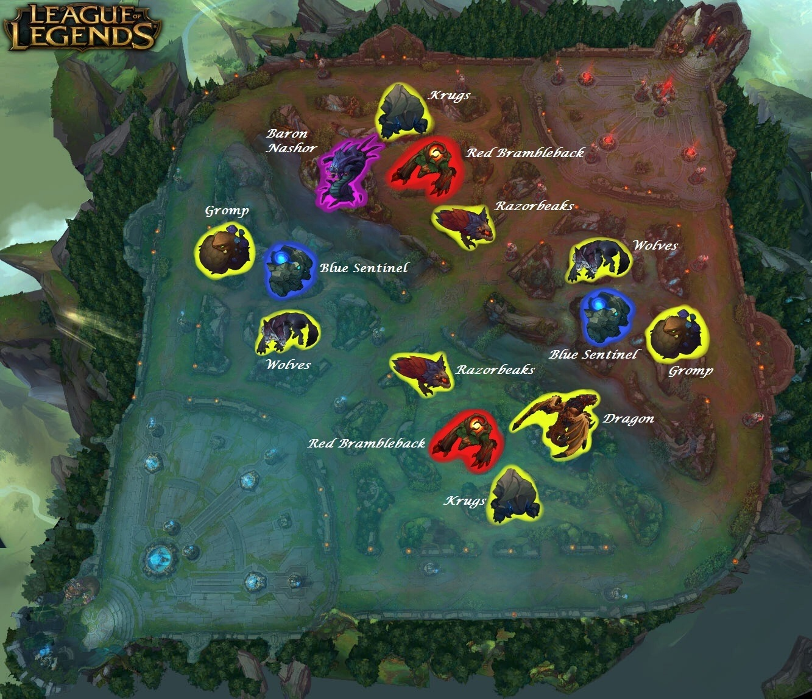

```{r setup, include=FALSE}
knitr::opts_chunk$set(echo = TRUE)
```

# Introduction


## League of Legends

League of Legends is a team-based strategy game where two teams of five powerful champions face off to destroy the other’s base. Choose from over 160 champions to make epic plays, secure kills, and take down towers as you battle your way to victory.

## Glossary

-   Warding totem: An item that can be used to provide visions for map/objectives control.
-   Minions: Valuable resources that can be killed to gain gold.
-   Jungle monsters: Valuable resources that can be killed to gain gold and buffs.
-   Elite monsters: Valuable resources that can be killed to gain massive advantages.
-   Dragons: Elite monster which gives team bonuses when killed. The 4th dragon killed by a team gives a massive stats bonus. The 5th dragon (Elder Dragon) offers a huge advantage to the team.
-   Herald: Elite monster which gives stats bonus when killed. It helps pushing a lane and destroying structures.
-   Towers: Structures you have to destroy to reach the enemy Nexus.
-   Level: Champion level. Start at 1. Max is 18.

## Dataset

This dataset contains the first 10min. stats of approx. 10k ranked games (SOLO QUEUE) from a high ELO (DIAMOND I to MASTER). Players have roughly the same level.

Each game is unique. The gameId can help you to fetch more attributes from the Riot API.

There are 19 features per team (38 in total) collected after 10min in-game. This includes kills, deaths, gold, experience, level.

```{r include=FALSE}
library(tidyverse)
library(scales)
```

```{r include=FALSE}
global <- read.csv("LeagueofLegends.csv", sep=",")
```

```{r echo=FALSE}
glimpse(global)
```

Let's check if there are any missing values.

```{r echo=FALSE}
colSums(is.na(global))
```

Let's check whether each attribute has the correct type

```{r echo=FALSE}
sapply(global, class)
```

For easy intepretation, I will create a new column "Winner"

```{r include=FALSE}
global$Winner <- ifelse(global$blueWins == 0, "Red", "Blue")
```

## The distribution between Red and Blue wins

```{r echo=FALSE}
ggplot(global, aes(x=Winner, fill=Winner)) + geom_bar() +
  scale_fill_manual(values=c("Blue" = "#61E8E1", "Red" = "#F25757")) +
  geom_text(stat='count', aes(label=percent(round(..count.. /sum(..count..), 1))), position = position_stack(vjust = 0.5)) 
  
```

## How does gold advantage affect one team's winrate ?

```{r include=FALSE}
blue_average <- global %>% 
  select(Winner, blueGoldDiff) %>% 
  filter(Winner == "Blue")
blue_average <- mean(blue_average$blueGoldDiff)
blue_matches <- global %>% 
  select(Winner, blueGoldDiff) %>% 
  filter(blueGoldDiff >= blue_average)
blue_wins <- blue_matches %>% 
  filter(Winner == "Blue")
```

Average gold when winning a game for blue team: `r blue_average`

```{r include=FALSE}
blue_winrate <- round(nrow(blue_wins) / nrow(blue_matches) * 100, 2)
```

Win rate for blue team when exceeding the average gold: `r blue_winrate`%

```{r include=FALSE}
red_average <- global %>% 
  select(Winner, redGoldDiff) %>% 
  filter(Winner == "Red")
red_average <- mean(red_average$redGoldDiff)
red_matches <- global %>% 
  select(Winner, redGoldDiff) %>% 
  filter(redGoldDiff >= red_average)
red_wins <- red_matches %>% 
  filter(Winner == "Red")
```

```{r include=FALSE}
red_winrate <- round(nrow(red_wins) / nrow(red_matches) * 100, 2)
```

Average gold when winning a game for red team: `r red_average`

Win rate for red team when exceeding the average gold: `r red_winrate`%

## First Blood

```{r include=FALSE}
blue_wins_with_first_blood <- nrow(global %>% filter(Winner == "Blue" & blueFirstBlood == 1))
blue_wins_without_first_blood <- nrow(global %>% filter(Winner == "Blue" & blueFirstBlood == 0))
red_wins_with_first_blood <- nrow(global %>% filter(Winner == "Red" & redFirstBlood == 1))
red_wins_without_first_blood <- nrow(global %>% filter(Winner == "Red" & redFirstBlood == 0))

win_distribution <- data.frame(
  Team = c("Blue", "Red"),
  Wins_with_First_Blood = c(blue_wins_with_first_blood, red_wins_with_first_blood),
  Wins_without_First_Blood = c(blue_wins_without_first_blood, red_wins_without_first_blood)
)

win_distribution <- win_distribution %>% 
  pivot_longer(cols = c(Wins_with_First_Blood, Wins_without_First_Blood), names_to = "Result", values_to = "Count")
```

```{r echo=FALSE}
ggplot(win_distribution, aes(x=Team, y=Count, fill=Result)) + geom_bar(stat="identity", position="stack") +
  scale_fill_manual(values=c("Wins_with_First_Blood" = "#61E8E1", "Wins_without_First_Blood" = "#F25757")) +
  labs(title = "First Blood Impact on Games") 
```

## Wards

### Wards Placed

Let's see the wards placed by each team

```{r}
blue_wards_placed <- global %>% 
  select(blueWardsPlaced) %>%
  mutate(Team = "Blue")

ggplot(blue_wards_placed, aes(x=blueWardsPlaced)) + geom_histogram(binwidth = 30, fill="#61E8E1", color="black") +
  labs(title = "Wards Placed by Blue Team")
```

```{r}
red_wards_placed <- global %>% 
  select(redWardsPlaced) %>%
  mutate(Team = "Red")

ggplot(red_wards_placed, aes(x=redWardsPlaced)) + geom_histogram(binwidth = 30, fill="#F25757", color="black") +
  labs(title = "Wards Placed by Red Team")
```

We can see that both team has a similar distribution of wards placed and also outliers. The outliers are likely due to the fact that in League of Legends, there are players that have bad attitudes and refuse to cooperate with their team, they just sit in the base and place wards to troll their team.

Let's see if placing more wards can help a team win the game.

```{r include=FALSE}
blue_wards <- global %>% 
  filter(blueWardsPlaced - redWardsPlaced > 0) %>% 
  select(Winner)
blue_wards_winner <- blue_wards %>% 
  filter(Winner == "Blue")

red_wards <- global %>% 
  filter(redWardsPlaced - blueWardsPlaced > 0) %>% 
  select(Winner)

red_wards_winner <- red_wards %>%
  filter(Winner == "Red")
```

Blue's team winrate when placing more wards: `r nrow(blue_wards_winner) / nrow(blue_wards) * 100`%

Red's team winrate when placing more wards: `r nrow(red_wards_winner) / nrow(red_wards) * 100`%

### Wards Destroyed

Let's see the wards destroyed by each team

```{r}
blue_wards_destroyed <- global %>% 
  select(blueWardsDestroyed) %>%
  mutate(Team = "Blue")

ggplot(blue_wards_destroyed, aes(x=blueWardsDestroyed)) + geom_histogram(binwidth = 5, fill="#61E8E1", color="black") +
  labs(title = "Wards Destroyed by Blue Team")
```

```{r}
red_wards_destroyed <- global %>% 
  select(redWardsDestroyed) %>%
  mutate(Team = "Red")

ggplot(red_wards_destroyed, aes(x=redWardsDestroyed)) + geom_histogram(binwidth = 5, fill="#F25757", color="black") +
  labs(title = "Wards Destroyed by Red Team")
```

Now, let's see if destroying a proportion of the enemy's wards can help a team win the game. Let's say 25%.

```{r}
blue_wards_diff <- global %>% 
  filter(blueWardsDestroyed >= 25 * redWardsPlaced / 100) %>% 
  select(Winner)
blue_wards_diff_winrate <- nrow(blue_wards_diff %>% filter(Winner == "Blue")) / nrow(blue_wards_diff) * 100
```

```{r}
red_wards_diff <- global %>% 
  filter(redWardsDestroyed >= 25 * blueWardsPlaced / 100) %>% 
  select(Winner)
red_wards_diff_winrate <- nrow(red_wards_diff %>% filter(Winner == "Red")) / nrow(red_wards_diff) * 100
```

Blue's team winrate when destroying 25% of the enemy's wards: `r blue_wards_diff_winrate`%

Red's team winrate when destroying 25% of the enemy's wards: `r red_wards_diff_winrate`%

## Minions

Let's see if having more minions killed can help a team win the game.

```{r}
blue_minions <- global %>% 
  filter(blueTotalMinionsKilled > redTotalMinionsKilled) %>% 
  select(Winner)

blue_minions_winrate <- nrow(blue_minions %>% filter(Winner == "Blue")) / nrow(blue_minions) * 100
```

```{r}
red_minions <- global %>% 
  filter(redTotalMinionsKilled > blueTotalMinionsKilled) %>% 
  select(Winner)

red_minions_winrate <- nrow(red_minions %>% filter(Winner == "Red")) / nrow(red_minions) * 100
```

Blue's team winrate when killing more minions: `r blue_minions_winrate`%

Red's team winrate when killing more minions: `r red_minions_winrate`%

## Neutral objectives

{width="50%"}

```{r}
global$firstDragon <- ifelse(global$blueDragons == 1, "Blue", ifelse(global$redDragons == 1, "Red", "None"))

dragon_pie <- global %>% 
  select(firstDragon) %>% 
  group_by(firstDragon) %>%
  summarise(Count=n()) %>% 
  mutate(Count = round(Count*100/sum(Count), digits=2))

dragon_pie <- dragon_pie %>% 
  arrange(desc(firstDragon)) %>% 
  mutate(ypos=cumsum(Count) - 0.5*Count)

ggplot(dragon_pie, aes(x="", y=Count, fill=firstDragon)) + 
  geom_bar(stat="identity", width=1, color="black") + 
  scale_fill_manual(values=c("Blue" = "#61E8E1", "Red" = "#F25757", "None" = "#F5E960")) +
  coord_polar("y", start=0) +
  theme_void() +
  geom_text(aes(y=ypos, label=paste0(Count, "%")), color="black", size=5) 
```

```{r}
global$firstHerald <- ifelse(global$blueHeralds == 1, "Blue", ifelse(global$redHeralds == 1, "Red", "None"))

herald_pie <- global %>% 
  select(firstHerald) %>% 
  group_by(firstHerald) %>%
  summarise(Count=n()) %>% 
  mutate(Count = round(Count*100/sum(Count), digits=2))

herald_pie <- herald_pie %>% 
  arrange(desc(firstHerald)) %>% 
  mutate(ypos=cumsum(Count) - 0.5*Count)

ggplot(herald_pie, aes(x="", y=Count, fill=firstHerald)) + 
  geom_bar(stat="identity", width=1, color="black") + 
  scale_fill_manual(values=c("Blue" = "#61E8E1", "Red" = "#F25757", "None" = "#F5E960")) +
  coord_polar("y", start=0) +
  theme_void() +
  geom_text(aes(y=ypos, label=paste0(Count, "%")), color="black", size=5) 
```

```{r include=FALSE}
heralds <- nrow(global %>% 
  filter(firstHerald == "None"))
dragons <- nrow(global %>% 
  filter(firstDragon == "None"))
```

Based on the map and two pie charts above, we can see why there is a huge difference between the probability of having first dragon/herald among 2 teams.

-   Firstly, the path to the dragon pit is more accessible for the red team, making them the better team to control and secure the dragon while the blue team has a better chance to secure the herald.
-   Secondly, since this data is just for the first 10 minutes, the Herald does not make much of an impact on the game. The dragon, on the other hand, can provide a huge advantage to the team that secures it first.
-   Out of `r nrow(global)` games, there are `r heralds` games where the first herald is not secured while there are `r dragons` games where the first dragon is not secured. We can see that dragons are much more preferred than heralds.

Let's see how many games the team that secures the first dragon/herald wins.

```{r}
blue_dragon <- global %>% 
  filter(blueDragons == 1) %>% 
  select(Winner)

blue_dragon_wins <- nrow(blue_dragon %>% filter(Winner == "Blue"))
blue_dragon_loses <- nrow(blue_dragon) - blue_dragon_wins

red_dragon <- global %>% 
  filter(redDragons == 1) %>% 
  select(Winner)

red_dragon_wins <- nrow(red_dragon %>% filter(Winner == "Red"))
red_dragon_loses <- nrow(red_dragon) - red_dragon_wins

dragon_summary <- data.frame(
  Team=c("Blue", "Red"),
  Wins=c(blue_dragon_wins, red_dragon_wins),
  Loses=c(blue_dragon_loses, red_dragon_loses)
) %>% 
  pivot_longer(cols=c(Wins, Loses), names_to="Result", values_to="Count")

ggplot(dragon_summary, aes(x=Team, y=Count, fill=Result)) + geom_bar(stat="identity", position="stack") +
  scale_fill_manual(values=c("Wins" = "#61E8E1", "Loses" = "#F25757")) +
  labs(title = "First Dragon Impact on Games") 
```

```{r}
blue_herald <- global %>% 
  filter(blueHeralds == 1) %>% 
  select(Winner)

blue_herald_wins <- nrow(blue_herald %>% filter(Winner == "Blue"))
blue_herald_loses <- nrow(blue_herald) - blue_herald_wins

red_herald <- global %>% 
  filter(redHeralds == 1) %>% 
  select(Winner)

red_herald_wins <- nrow(red_herald %>% filter(Winner == "Red"))
red_herald_loses <- nrow(red_herald) - red_herald_wins

herald_summary <- data.frame(
  Team=c("Blue", "Red"),
  Wins=c(blue_herald_wins, red_herald_wins),
  Loses=c(blue_herald_loses, red_herald_loses)
) %>% 
  pivot_longer(cols=c(Wins, Loses), names_to="Result", values_to="Count")

ggplot(herald_summary, aes(x=Team, y=Count, fill=Result)) + geom_bar(stat="identity", position="stack") +
  scale_fill_manual(values=c("Wins" = "#61E8E1", "Loses" = "#F25757")) +
  labs(title = "First Herald Impact on Games")
```

What about the winrate when securing both the first dragon and herald ?

```{r}
blue_objectives <- global %>% 
  filter(blueDragons == 1 & blueHeralds == 1) %>% 
  select(Winner)

blue_objectives_winrate <- nrow(blue_objectives %>% filter(Winner == "Blue")) / nrow(blue_objectives) * 100

red_objectives <- global %>% 
  filter(redDragons == 1 & redHeralds == 1) %>% 
  select(Winner)

red_objectives_winrate <- nrow(red_objectives %>% filter(Winner == "Red")) / nrow(red_objectives) * 100
```

For blue team, the winrate when securing both the first dragon and herald: `r blue_objectives_winrate`%

For red team, the winrate when securing both the first dragon and herald: `r red_objectives_winrate`% 

## KDA (Kill, Death, Assist) 
KDA is a metric that measures the performance of a player in a game. It is calculated by the formula (Kills + Assists) / Deaths. Should the Deaths be 0, the denominator is set to 1. The higher the KDA, the better the player is performing.

Let's create new columns "KDA" for both teams.

```{r}
global$blueKDA <- (global$blueKills + global$blueAssists) / ifelse(global$blueDeaths == 0, 1, global$blueDeaths)
global$redKDA <- (global$redKills + global$redAssists) / ifelse(global$redDeaths == 0, 1, global$redDeaths)

blue_kda <- global %>% 
  filter(blueKDA > redKDA)
red_kda <- global %>% 
  filter(redKDA > blueKDA)
blue_kda_winrate <- nrow(blue_kda %>% filter(Winner == "Blue")) / nrow(blue_kda) * 100
red_kda_winrate <- nrow(red_kda %>% filter(Winner == "Red")) / nrow(red_kda) * 100
```

Blue's team winrate when having a higher KDA: `r blue_kda_winrate`%

Red's team winrate when having a higher KDA: `r red_kda_winrate`%

We see that KDA plays a significant role in determining the outcome of the game.

## Jungle

As a seasoned player, I would say that the jungle role is the most important role in the game. The jungler is responsible for securing objectives, providing vision, and helping the team in laning phase, small fights. Let's see how the jungle role affects the game.

To determine the impact of the jungle role, we will look at the total jungle monsters killed by each team and the number of elite monsters killed by each team. I would say that a better jungler would have a higher number of jungle monsters killed and elite monsters killed.

```{r}
blue_jungle <- global %>% 
  filter((blueTotalJungleMinionsKilled > redTotalJungleMinionsKilled) 
         & (blueEliteMonsters > redEliteMonsters)) %>% 
  select(Winner)

blue_jungle_winrate <- nrow(blue_jungle %>% filter(Winner == "Blue")) / nrow(blue_jungle) * 100

red_jungle <- global %>% 
  filter((redTotalJungleMinionsKilled > blueTotalJungleMinionsKilled) 
         & (redEliteMonsters > blueEliteMonsters)) %>% 
  select(Winner)

red_jungle_winrate <- nrow(red_jungle %>% filter(Winner == "Red")) / nrow(red_jungle) * 100
```

Blue's team winrate when having a better jungler: `r blue_jungle_winrate`%

Red's team winrate when having a better jungler: `r red_jungle_winrate`%

So if possible, you should help your jungler in any way you can. It can be as simple as providing vision, helping him secure objectives, defending his camps from the enemy jungler, it all helps.

## Turrets

Turret takedowns are crucial in League of Legends because it allows players to roam freely, control vision, setup team fights. 
```{r}
blue_turrets_count <- global %>% 
  group_by(blueTowersDestroyed) %>% 
  summarise(Count=n()) 

red_turrets_count <- global %>%
  group_by(redTowersDestroyed) %>% 
  summarise(Count=n()) 

ggplot(blue_turrets_count, aes(x=blueTowersDestroyed, y=Count)) + geom_bar(stat="identity", fill="#61E8E1", color="black") +
  labs(title = "Blue Team Turrets Destroyed")

ggplot(red_turrets_count, aes(x=redTowersDestroyed, y=Count)) + geom_bar(stat="identity", fill="#F25757", color="black") +
  labs(title = "Red Team Turrets Destroyed")
```

We see that there are some games where the blue team destroyed 3, 4 turrets while red team couldn't. This could be due to the fact that the blue team had access to the Herald. 
```{r}
blue_turrets_diff <- global %>% 
  filter(blueTowersDestroyed >= 3)

blue_turrets_diff_winrate <- nrow(blue_turrets_diff %>% filter(blueHeralds == 1))
```

In `r nrow(blue_turrets_diff)` games where the blue team destroyed 3 or more turrets, there are `r blue_turrets_diff_winrate` games where the blue team secured the Herald. 

Let's consider the winrate for both team regarding destroying 0, 1 or 2 turrets.
```{r}
blue_0_turrets_winrate <- nrow(global %>% filter(Winner == "Blue" & blueTowersDestroyed == 0)) / nrow(global %>% filter(blueTowersDestroyed == 0)) * 100

blue_1_turrets_winrate <- nrow(global %>% filter(Winner == "Blue" & blueTowersDestroyed == 1)) / nrow(global %>% filter(blueTowersDestroyed == 1)) * 100

blue_2_turrets_winrate <- nrow(global %>% filter(Winner == "Blue" & blueTowersDestroyed == 2)) / nrow(global %>% filter(blueTowersDestroyed == 2)) * 100

red_0_turrets_winrate <- nrow(global %>% filter(Winner == "Red" & redTowersDestroyed == 0)) / nrow(global %>% filter(redTowersDestroyed == 0)) * 100

red_1_turrets_winrate <- nrow(global %>% filter(Winner == "Red" & redTowersDestroyed == 1)) / nrow(global %>% filter(redTowersDestroyed == 1)) * 100

red_2_turrets_winrate <- nrow(global %>% filter(Winner == "Red" & redTowersDestroyed == 2)) / nrow(global %>% filter(redTowersDestroyed == 2)) * 100
```

```{r}
turrets_winrate <- data.frame(
  Team = c("Blue", "Red"),
  turrets_0 = c(blue_0_turrets_winrate, red_0_turrets_winrate),
  turrets_1 = c(blue_1_turrets_winrate, red_1_turrets_winrate),
  turrets_2 = c(blue_2_turrets_winrate, red_2_turrets_winrate)
)
```

```{r}
library(knitr)
kable(turrets_winrate)
```

Seems weird that with taking down 2 turrets, the winrate for blue team is much higher than red team. Unfortunately, since the dataset is limited and the gameID cannot be used to fetch more statistics from the Riot API anymore, we cannot determine the exact reason for this.

## Experience

Experience or XP is game mechanic that allows champions to level up after reaching certain amounts of XP. Leveling up unlocks new abilities or higher ranks of existing abilities. Many base stats and some items, runes, buffs, as well as certain abilities, scale with champion level. Experience normally isn't gained passively over time, and must instead be earned through various different means, such as killing minions, monsters, champions, or by being near a minion or monster when it dies.

In League of Legends, there is a term called "denying minions". Basically, it means that you are trying to prevent the enemy from getting near the minions to gain experience. Since this data is about Diamond elo, a little lead can make a huge impact. For example, reaching level 2 or 6 can mean a kill or at least a summoner spell for these players.

Let's see how having more experience can affect the game.
```{r}
blue_experience_wins <- global %>% 
  filter(blueExperienceDiff > redExperienceDiff) %>% 
  select(Winner) %>% 
  filter(Winner == "Blue")

blue_experience_loss <- global %>% 
  filter(blueExperienceDiff > redExperienceDiff) %>% 
  select(Winner) %>% 
  filter(Winner == "Red")

red_experience_wins <- global %>% 
  filter(redExperienceDiff > blueExperienceDiff) %>% 
  select(Winner) %>% 
  filter(Winner == "Red")

red_experience_loss <- global %>% 
  filter(redExperienceDiff > blueExperienceDiff) %>% 
  select(Winner) %>% 
  filter(Winner == "Blue")

exp_summary <- data.frame(
  Team = c("Blue", "Red"),
  Wins = c(nrow(blue_experience_wins), nrow(red_experience_wins)),
  Loss = c(nrow(blue_experience_loss), nrow(red_experience_loss))
) %>% 
  pivot_longer(cols=c(Wins, Loss), names_to="Result", values_to="Count")

ggplot(exp_summary, aes(x=Team, y=Count, fill=Result)) + geom_bar(stat="identity", position="stack") +
  scale_fill_manual(values=c("Wins" = "#61E8E1", "Loss" = "#F25757"))
```

## Logistic Regression

